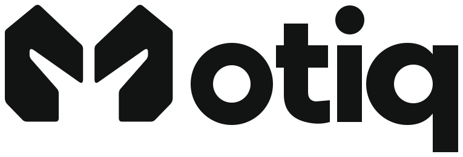

<picture>
  <source media="(prefers-color-scheme: dark)" srcset="assets/brand/motiq-reversed.svg">
  
</picture>

# Motiq website

Public website and canonical brand assets for [Motiq](https://www.motiq.biz), a three-person engineering team building robotics, computer vision, private AI and automation with robots and AI.

The site is static HTML, CSS and JavaScript, with English (`index.html`) and Croatian (`hr.html`) pages. GitHub Pages publishes the root of `master` to **www.motiq.biz**.

## Local preview

```sh
python3 -m http.server 8766 --bind 127.0.0.1
```

Open `http://127.0.0.1:8766`. Check both languages, light/dark themes and mobile layout before publishing.

## Content and build

Edit `src/site.html` for shared structure, `locales/en.json` / `locales/hr.json` for copy, and `css/tokens.css` / `css/style.css` for styling. Run:

```sh
npm run build
```

The build validates matching translation keys and generates both entry pages with content-hashed CSS and JavaScript. Commit the source, generated pages and referenced asset exports together. Older hashed assets remain available for cached pages. No framework, backend or runtime dependency is required.

The AI-BOOST section describes selection for ADVANCE and ongoing prototype development; it does not claim a completed robot deployment or prize funding. The document-assistant panel is an explicitly illustrative example. The contact form prepares a message in the visitor's email app; visitors send it themselves.

The approved brand package on Google Drive was checked against the canonical assets for this refresh. Forest green remains `#1E3A2E`; olive and terracotta from the existing web palette provide supporting accents.

## Logo

[`assets/brand/master.json`](assets/brand/master.json) is the only editable source of the approved M + gripper logo. All SVG and PNG files are derived exports. The [brand guide](assets/brand/README.md) covers variants and usage.

```sh
npm ci
npm run brand:build
```

Node dependencies are used for asset generation only. The public website needs no Node server. The standalone `motiq.final.html` file is an earlier design draft; the live entry points are `index.html` and `hr.html`.
